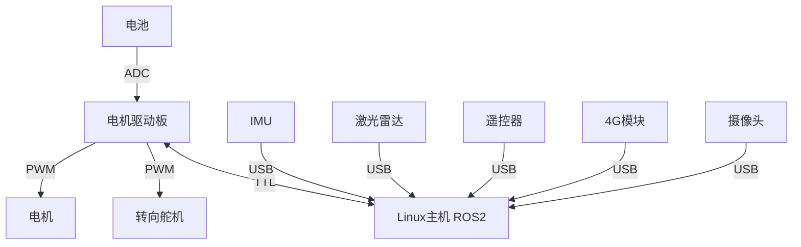

# FOR_CC_ROS2 导航小车项目

## 1. 项目概述

本项目是一个基于 **ROS2** 开发的智能导航小车系统，核心采用 **C++** 编程实现。项目旨在提供一套完整的自主移动机器人解决方案，涵盖底层硬件驱动、传感器数据融合、SLAM建图、路径规划以及视觉跟随等功能。项目运行环境为 **Linux 主机**（推荐 Ubuntu 22.04 / 20.04），**完全兼容并支持在 ARM64 架构的开发板（如树莓派 5B、Jetson Nano 等）上部署运行**。

### 核心目录结构
- `src/cc_chassis/`：底盘控制驱动。
- `src/cc_nav/`：导航配置文件。
- `src/cc_teleop/`：手柄遥控转换。
- `src/cc_vision/`：视觉跟随。
- `src/navcase_interfaces/`：**核心通信接口包**，统一定义了 `SensorData`, `RobotStatus`, `ControlCommand` 等本项目专用消息。
- `third_party/`：存放项目运行所依赖的第三方开源库或工具包（如 `sllidar_ros2`）。

---

## 2. 系统架构与硬件清单

### 2.1 系统架构图

本项目采用集中式计算与分布式控制相结合的硬件架构，具体连接拓扑如下：



### 2.2 硬件清单及连接说明

本项目所需的核心硬件外设及连接方式如下：

| 硬件名称 | 功能描述 | 连接方式说明 |
| :--- | :--- | :--- |
| **Linux主机** | 运行ROS2系统的核心计算平台。 | 系统的中心节点（支持x86电脑或树莓派5B等ARM64开发板），通过USB和TTL连接各外设。 |
| **USB 摄像头** | 用于采集前方视觉图像，支持视觉跟随及目标识别。 | 通过 **USB** 接口连接至 Linux 主机。 |
| **USB 激光雷达** | 用于获取周围环境的二维点云数据，支持 SLAM 建图与避障。 | 通过 **USB** 接口连接至 Linux 主机。 |
| **IMU** | 惯性测量单元，提供小车的姿态和加速度数据，辅助定位。 | 通过 **USB** 接口连接至 Linux 主机。 |
| **4G模块** | 提供远程通信和广域网连接能力。 | 通过 **USB** 接口连接至 Linux 主机。 |
| **USB 遥控器** | 用于手动模式下的人工遥控接管与操作。 | 无线接收器通过 **USB** 接口连接至 Linux 主机。 |
| **电机驱动板** | 核心控制板，负责解析主机指令并驱动电机与舵机。 | 通过 **TTL** 串口连接至 Linux 主机。 |
| **电机** | 执行机构，驱动小车车轮移动。 | 通过 **PWM** 信号线连接至 **电机驱动板**。 |
| **转向舵机** | 用于实现小车前轮的阿克曼转向控制。 | 通过 **PWM** 信号线连接至 **电机驱动板**。 |
| **电池** | 系统供电单元，并支持电量监测。 | 供电，并通过 **ADC** 接口连接至 **电机驱动板** 以监测电压。 |

---

### 2.3 底盘串口通信协议 (16字节)

Linux主机与电机驱动板之间通过 TTL 串口（波特率 115200）进行全双工通信，固定帧长为 16 字节，协议结构如下：

| 字节索引 | 名称 | 取值/说明 |
| :--- | :--- | :--- |
| 0 | **帧头** | 固定为 `0xAA` |
| 1 | **身份** | 主机: `0x01`，从机(驱动板): `0x03` |
| 2 | **数据长度** | 固定为 `0x0B` (11个字节数据) |
| 3 | **系统状态** | `0x00`=空闲, `0x01`=正常, `0x02`=故障, `0x03`=过流, `0x04`=过热 |
| 4 | **运行模式** | `0x00`=控制模式, `0x01`=刹车模式 |
| 5 | **电机1方向** | `0x00`=正转, `0x01`=反转 |
| 6-7 | **电机1速度** | 高8位与低8位拼接，范围 `0-1024` |
| 8 | **电机2方向** | `0x00`=正转, `0x01`=反转 |
| 9-10 | **电机2速度** | 高8位与低8位拼接，范围 `0-1024` |
| 11 | **电池电压** | ADC 采样值，范围 `0-255` |
| 12 | **舵机角度** | 范围 `0-255` (128 为中位) |
| 13 | **传感器1** | 预留，范围 `0-255` |
| 14 | **校验和** | 数据区（索引3至13）累加和取余 256（`% 256`） |
| 15 | **帧尾** | 固定为 `0xBB` |

---

## 3. 功能模块介绍

小车支持三大核心功能，可通过不同的 Launch 文件或指令进行模式切换：

### 3.1 手动控制模式 (Manual)
- **触发逻辑**：启动底盘基础驱动节点与手柄控制节点。
- **核心实现路径**：通过 2.4G/蓝牙遥控器产生按键与摇杆数据，支持急停按钮。控制转换节点订阅遥控器消息并将其映射为小车的线速度和角速度，最后由底盘驱动节点解析并下发给电机驱动板。

### 3.2 自动驾驶导航模式 (Drive)
- **触发逻辑**：启动激光雷达、IMU、底盘节点，以及基于 Nav2 的导航框架。
- **核心实现路径**：基于激光雷达+IMU+摄像头融合建图（SLAM）。支持全局路径规划（A* / Dijkstra / RRT*）与动态避障（TEB / DWA）。用户可通过 APP/遥控器输入坐标或语音指令设定目标点，系统支持多段路径记忆与自动巡航（如机场航站楼→登机口）。

### 3.3 自动跟随模式 (Follow)
- **触发逻辑**：启动底盘、摄像头节点及视觉跟随算法。
- **核心实现路径**：基于视觉+激光雷达融合的目标跟踪（YOLOv5 + PointNet++ 或 OpenPose + ICP配准），支持人形/背包/手持物识别。跟随距离自适应调节（0.5~2m可调），带有防丢失报警（遮挡时蜂鸣+APP推送）。支持通过长按遥控器切换多目标。

### 3.4 辅助与安全功能
- **智能电量管理**：实时监测电池电压，低电量（<20%）时触发预警，并支持自动返航至无线充电座。
- **全方位安全机制**：
  - **硬件层**：机械式急停开关（断开电机驱动电源）。
  - **软件层**：Linux主机看门狗异常重启保护。
  - **驱动层**：电机过流/过热保护，以及基于 IMU 垂直加速度突变的防跌落检测（触发急停）。

---

## 4. 快速上手指南

### 4.1 环境搭建步骤

1. **操作系统与 ROS2 版本要求**：
   - 推荐系统：Ubuntu 22.04 LTS
   - ROS2 版本：ROS2 Humble (若使用 Ubuntu 20.04 则对应 ROS2 Foxy)
   - 安装指南参考：[ROS2 官方安装文档](https://docs.ros.org/en/humble/Installation.html)

2. **Linux 系统依赖安装**：
   ```bash
   # 更新系统软件包
   sudo apt update && sudo apt upgrade -y
   
   # 安装项目常用依赖工具
   sudo apt install -y build-essential git cmake
   sudo apt install -y ros-$ROS_DISTRO-joy ros-$ROS_DISTRO-teleop-twist-joy ros-$ROS_DISTRO-navigation2 ros-$ROS_DISTRO-nav2-bringup ros-$ROS_DISTRO-cv-bridge ros-$ROS_DISTRO-image-transport ros-$ROS_DISTRO-usb-cam
   ```

### 4.2 硬件接线指南
1. **供电确认**：请确保电机驱动板和舵机有独立且充足的供电，不要直接使用主机的 5V 输出驱动大功率外设。
2. **信号连接**：
   - 将 USB 激光雷达、USB 摄像头、遥控器接收器插入主机的 USB 接口。
   - 确认 TTL 串口的 TX/RX 交叉连接（主机的 TX 接驱动板的 RX，主机的 RX 接驱动板的 TX），并共地（GND 相连）。
3. **端口绑定（可选）**：建议在 Linux 系统中通过 `udev` 规则绑定各 USB 设备的端口号，防止重启后端口号漂移（如 `/dev/lidar`, `/dev/motor_board`）。
4. **树莓派 5B 专属说明**：
   - 树莓派的硬件串口（如 `/dev/ttyAMA0`）默认可能被蓝牙或终端占用，请在 `sudo raspi-config` 或 `/boot/firmware/config.txt` 中开启串口硬件并关闭串口登录终端。
   - 在树莓派 Ubuntu 上，建议同样将用户加入 `dialout` 用户组以获得 GPIO 和串口的操作权限。

### 4.3 项目依赖克隆与编译

除了自行编写的核心功能包外，本项目还依赖第三方雷达驱动（如思岚雷达 `sllidar_ros2`）。

```bash
# 1. 克隆雷达驱动源码到 third_party 目录
cd ~/FOR_CC_ROS2/third_party
git clone https://github.com/Slamtec/sllidar_ros2.git

# 2. 返回工作空间根目录并编译
cd ~/FOR_CC_ROS2
colcon build --symlink-install --cmake-args -DPython3_EXECUTABLE=/usr/bin/python3

# 3. 设置环境变量 (每次打开新终端都需要执行)
source install/setup.bash
```

### 4.4 各功能模式操作方法

> **注意**：运行前请确保相关硬件的 USB 或串口已赋予权限（如 `sudo chmod 777 /dev/ttyUSB0`）。

- **启动底盘与激光雷达 (基础 Bringup)**：
  ```bash
  ros2 launch cc_chassis bringup.launch.py
  ```
  *说明：该启动文件会同时拉起底盘控制节点以及思岚激光雷达节点（默认配置为 A1 型号）。如果您使用的是 A2/A3 等其他型号雷达，请前往 `src/cc_chassis/launch/bringup.launch.py` 修改对应的 lidar launch 文件名。*

- **手动控制模式**：
  ```bash
  ros2 launch cc_teleop teleop_joy.launch.py
  ```
  启动后，拨动遥控器摇杆即可控制小车移动。

- **自动驾驶导航模式**：
  ```bash
  # 启动导航框架与地图
  ros2 launch cc_nav nav2_bringup.launch.py map:=<你的地图路径>.yaml
  ```
  在 RViz2 中使用 `2D Goal Pose` 工具指定目标点。

- **自动跟随模式**：
  ```bash
  ros2 launch cc_vision auto_follow.launch.py
  ```
  将目标物体置于摄像头视野中央，小车将自动调整姿态进行跟随。

---

## 5. 常见问题排查指引

1. **设备权限不足（串口或 USB 无法打开）**
   - **症状**：节点启动报错，提示无法打开 `/dev/ttyUSB0` 或 `/dev/video0`。
   - **解决**：赋予对应端口权限，或将当前用户加入 `dialout` 与 `video` 用户组：
     ```bash
     sudo usermod -aG dialout $USER
     sudo usermod -aG video $USER
     sudo chmod 777 /dev/ttyUSB0
     ```

2. **colcon build 编译报错 (如提示缺少 catkin_pkg 或 symlink 失败)**
   - **症状 1**：提示 `ModuleNotFoundError: No module named 'catkin_pkg'` 或类似 Python 依赖缺失。
   - **原因**：这是因为当前处于 Conda 虚拟环境（如 miniconda3/anaconda3），导致 ROS2 的 CMake 脚本使用了错误的 Python 解释器。
   - **解决**：在 `colcon build` 后面务必加上 `--cmake-args -DPython3_EXECUTABLE=/usr/bin/python3`，强制指定系统的 Python 解释器。
   - **症状 2**：提示 `existing path cannot be removed: Is a directory`。
   - **原因**：之前使用 `packages-select` 单独编译遗留的缓存与全局编译的软链接产生了冲突。
   - **解决**：在项目根目录下执行 `rm -rf build/ install/ log/` 清理缓存后，再次执行编译。

3. **导航模式下小车原地旋转或规划失败**
   - **症状**：给出目标点后，小车无法到达或不断重规划。
   - **解决**：
     - 检查 TF 树是否完整（`ros2 run tf2_tools view_frames`）。
     - 检查雷达点云是否正常发布，在 RViz2 中查看激光雷达数据是否与地图匹配。
     - 检查代价地图（Costmap）参数，确认小车膨胀半径是否过大导致无法通过狭窄通道。
